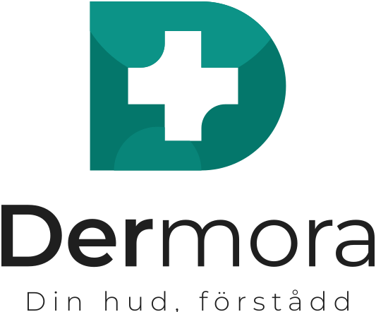

<p align="center">
  
</p>

# Dermora

**Personlig hudvägledning med AI.** En mobilapp där användaren beskriver sin hud, svarar på frågor med villkorade följdfrågor, laddar upp bilder, får strukturerad AI-vägledning, diskuterar den i en chat och bekräftar en behandlingsplan som sparas.

> Release 1 / MVP. Studentprojekt – **Grupp 6**: Youssef, Even, Anas, Adam, Ali, Assad.
> Dermora ger vägledning, inte medicinsk diagnos.

| | |
|---|---|
| Landningssida (kund) | `apps/web/index.html` → publiceras till GitHub Pages |
| Projektpresentation (lärare) | `apps/web/presentation.html` – team, arkitektur, roadmap, arbetssätt |
| Mobilapp | `apps/mobile` – React Native + Expo + TypeScript |
| Backend | `apps/api` – FastAPI (Python) |
| Databas / auth / bildlagring | `supabase/schema.sql` – PostgreSQL + RLS + privat bucket |
| Dokumentation | `docs/` – se index nedan |

## Användarresan (MVP)

```
Welcome → Skapa konto / Logga in → Verifiera e-post → Grundprofil
→ Frågeformulär (villkorade följdfrågor) → Ladda upp bild (ansiktsguide + kvalitetskontroll)
→ AI får frågesvar + bildkontext → Användaren diskuterar med AI
→ AI föreslår strukturerad plan → Användaren bekräftar → Planen sparas och kan visas
```

## Arkitektur i korthet

```
┌──────────────┐   HTTPS/JSON   ┌───────────────┐        ┌──────────────────────┐
│  Mobilapp    │ ─────────────▶ │  FastAPI      │ ─────▶ │ Supabase             │
│  Expo / RN   │ ◀───────────── │  apps/api     │        │  Postgres + RLS       │
└──────────────┘                │  validerar,   │        │  Auth (JWT)           │
        │ Supabase Auth (JWT)   │  bygger       │        │  Storage: skin-images │
        └──────────────────────▶│  kontext,     │        └──────────────────────┘
                                │  face-check   │ ─────▶ ┌──────────────────────┐
                                │               │        │ Gemini (multimodal)  │
                                └───────────────┘        │ strukturerad output  │
                                                         └──────────────────────┘
```

Appen pratar bara med backend (plus Supabase Auth för inloggning). Backend är den enda som pratar med databasen, bildlagringen och AI-tjänsten.

## Kom igång på 10 minuter

Allt kan köras **utan** Supabase och utan AI-nyckel (mock-läge) – det är så vi demar sprint 1.

**Repo:** https://github.com/anasnassan92-cmyk/dermora

### 1. Backend

```bash
cd apps/api
python -m venv .venv
.venv\Scripts\activate          # Windows   (mac/linux: source .venv/bin/activate)
pip install -r requirements-dev.txt
copy .env.example .env          # mac/linux: cp
uvicorn src.main:app --reload --port 8000
```

Öppna http://localhost:8000/docs. Testa: `pytest`.

### 2. Mobilapp

```bash
cd apps/mobile
npm install
copy .env.example .env          # sätt EXPO_PUBLIC_API_URL=http://<din-dators-ip>:8000 för att köra mot backend
npx expo start
```

Skanna QR-koden med Expo Go. Utan `.env` körs appen helt på mock-data. Typkontroll: `npm run typecheck`.

### 3. Landningssidan

```bash
cd apps/web
python -m http.server 8085
```

Öppna http://localhost:8085 (kundsidan) och http://localhost:8085/presentation.html (presentationen).

### 4. Riktig databas + AI (när ni är redo)

1. Skapa ett Supabase-projekt (EU-region). Kör `supabase/schema.sql` och `supabase/seed.sql` i SQL-editorn.
2. Fyll i `SUPABASE_URL`, `SUPABASE_SERVICE_ROLE_KEY`, `SUPABASE_JWT_SECRET` i `apps/api/.env`.
3. Fyll i `EXPO_PUBLIC_SUPABASE_URL` och `EXPO_PUBLIC_SUPABASE_ANON_KEY` i `apps/mobile/.env`.
4. Skapa en gratis Gemini-nyckel på https://aistudio.google.com/apikey och sätt `AI_PROVIDER=gemini` + `GEMINI_API_KEY` i `apps/api/.env`.
5. (Valfritt) Aktivera Cloud Vision API i ett Google Cloud-projekt, skapa en API-nyckel och sätt `FACE_DETECTOR=google` + `GOOGLE_VISION_API_KEY`. Utan detta används OpenCV lokalt.

Detaljer: [docs/09-setup-and-requirements.md](docs/09-setup-and-requirements.md).

## Dokumentation

| Fil | Innehåll |
|---|---|
| [docs/01-vision.md](docs/01-vision.md) | Problem, mål, målgrupp, vad som ingår i Release 1 |
| [docs/02-architecture.md](docs/02-architecture.md) | Systemarkitektur, dataflöden, mappstruktur |
| [docs/03-database.md](docs/03-database.md) | ER-diagram, tabeller, RLS, lagring, GDPR |
| [docs/04-api-contract.md](docs/04-api-contract.md) | Alla endpoints med exempel |
| [docs/05-ai-and-face-detection.md](docs/05-ai-and-face-detection.md) | Gemini-provider, Google Vision-ansiktskontroll, säkerhetsregler |
| [docs/06-team-and-workflow.md](docs/06-team-and-workflow.md) | Sex ansvarsområden, Git-regler, Scrum |
| [docs/07-sprint-plan.md](docs/07-sprint-plan.md) | Sprint 0–3 med mål per person |
| [docs/08-figma-import.md](docs/08-figma-import.md) | Så får ni in designen i Figma |
| [docs/09-setup-and-requirements.md](docs/09-setup-and-requirements.md) | Konton, nycklar, kostnader, checklista |
| [docs/10-presentation-notes.md](docs/10-presentation-notes.md) | Talmanus och demo-flöde för redovisningen |

## Skärmdumpar

`python scripts/screenshots.py` tar 16 skärmdumpar från den körande webbversionen av appen (`?preview=<Screen>`, se `apps/mobile/src/dev/PreviewApp.tsx`) till `apps/web/assets/screens/`. Landningssidans sektion **Appen** visar dem.

## Repo-struktur

```
dermora/
├── apps/
│   ├── web/            # statisk landningssida + presentation (HTML/CSS/JS, brand kit)
│   ├── mobile/         # Expo-app: src/{components,features,navigation,services,hooks,types,utils,constants,theme}
│   └── api/            # FastAPI: src/{api/routes,core,schemas,services,repositories,data}, tests/
├── supabase/           # schema.sql (tabeller, RLS, storage), seed.sql
├── packages/brand/     # färg-tokens, Montserrat-css, tailwind-config från brand kit v1.1
├── docs/
└── .github/            # CI, Pages-deploy, PR-mall, CODEOWNERS
```

## Git-regler

Ingen utvecklar direkt på `main`. Branch per feature (`feat/auth-login`), pull request, minst en granskare, merge. Se [docs/06-team-and-workflow.md](docs/06-team-and-workflow.md).
